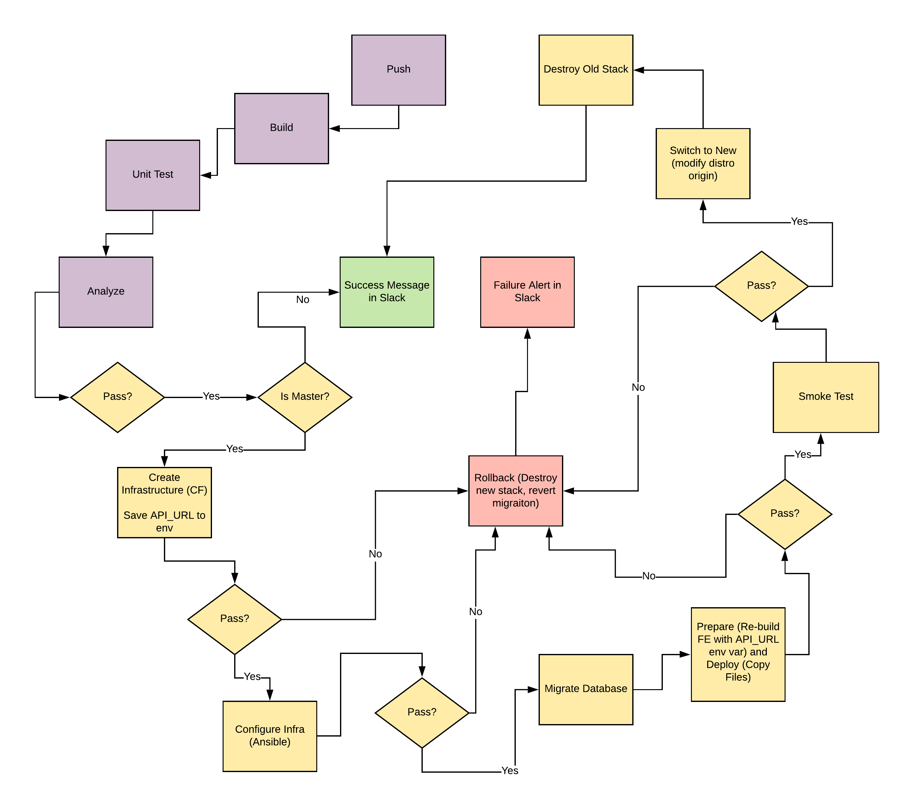

## Give your Application Auto-Deploy Superpowers

Here are the learning objectives of the project:

- Explain the fundamentals and benefits of CI/CD to achieve, build, and deploy automation for cloud-based software products.
- Utilize Deployment Strategies to design and build CI/CD pipelines that support Continuous Delivery processes.
- Utilize a configuration management tool to accomplish deployment to cloud-based servers.
- Surface critical server errors for diagnosis using centralized structured logging.



### Instructions

* [Getting Started](instructions/0-getting-started.md)
* [Selling CI/CD](instructions/1-selling-cicd.md)
* [Deploying Working, Trustworthy Software](instructions/2-deploying-trustworthy-code.md)
* [Configuration Management](instructions/3-configuration-management.md)
* [Turn Errors into Sirens](instructions/4-turn-errors-into-sirens.md)

### Project

- We setup env file in the backend .env. 

- Npm install for backend and frontend
```bash
(cd frontend; npm i) && (cd backend; npm i)
```

- At first build there are errors in both the backend and frontend. This is for testing purposes.

- Here are some scripts commands that you can run with npm run script-command. migrate, test, build, start. If migration fails make sure to check that your db is running and the env values are connect. 

- You need to make a document where you express the need for CI/CD pipeline in business terms. 5 slide presentation to convince your boss. In pdf format.

### Built With

- [Circle CI](www.circleci.com) - Cloud-based CI/CD service
- [Amazon AWS](https://aws.amazon.com/) - Cloud services
- [AWS CLI](https://aws.amazon.com/cli/) - Command-line tool for AWS
- [CloudFormation](https://aws.amazon.com/cloudformation/) - Infrastrcuture as code
- [Ansible](https://www.ansible.com/) - Configuration management tool
- [Prometheus](https://prometheus.io/) - Monitoring tool

